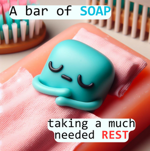
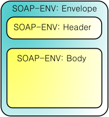
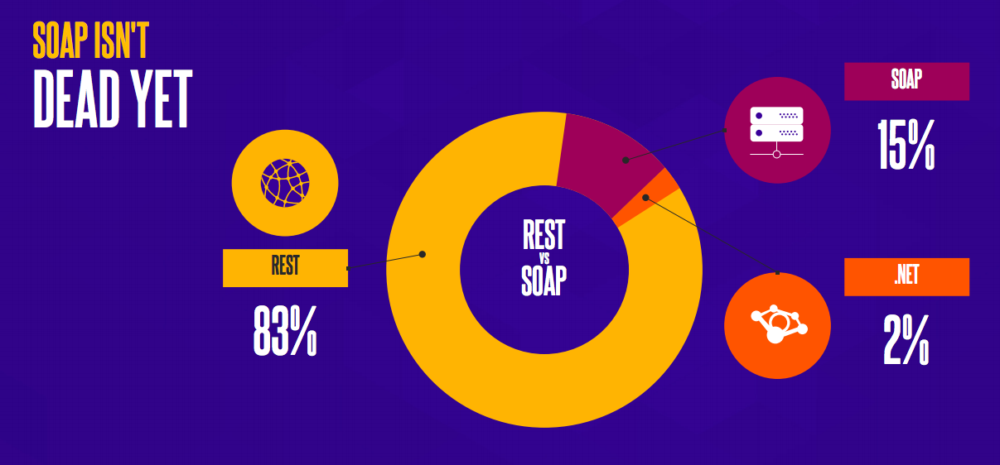
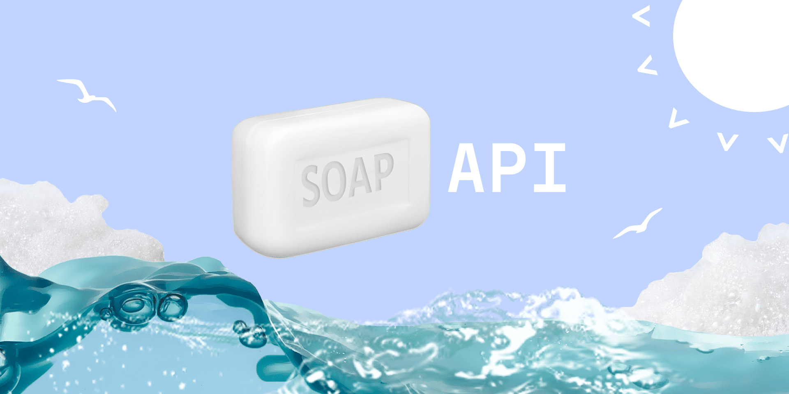

**Доповідь підготувала:** 

*студентка 2-го курсу, групи ІМ-21*<span padding-right:5em></span> **Ксенія ГОРАЙ** [Пошта: horaiksenia@gmail.com, [Телеграм](https://t.me/KseniiaHorai)]

**Керівник**

*доцент кафедри ОТ ФІОТ, к.т.н., доцент*<span padding-right:5em></span> **Андрій БОЛДАК** 

[НТУУ "КИЇВСЬКИЙ ПОЛІТЕХНІЧНИЙ ІНСТИТУТ імені ІГОРЯ СІКОРСЬКОГО](https://kpi.ua/)

[Факультет інформатики та обчислювальної техніки](https://fiot.kpi.ua/)

[Кафедра обчислювальної техніки](https://comsys.kpi.ua/)

Київ

<p align="center">
  
</p>

# SOAP vs. REST: У чому принципова різниця?

Виконавла:

студентка 2-го курсу, групи ІМ-21 Ксенія ГОРАЙ [Пошта: horaiksenia@gmail.com, Телеграм (opens new window)]

Керівник

доцент кафедри ОТ ФІОТ, к.т.н., доцент Андрій БОЛДАК


Це питання залишається актуальним вже досить давно. Насправді, це всього лише дві відповіді на одне і те ж питання: як отримати доступ до веб-сервісів. Але іноді зробити вибір між ними може бути напрочуд складно.

## SOAP (Simple Object Access Protocol)

SOAP - протокол обміну структурованими повідомленнями, який з'явився 1998 року і наразі підтримується World Wide Web Consortium (W3C) - міжнародною організацією, що займається розвитком інтернету. Розроблений компанією Microsoft, SOAP не такий ‘simple’, як може здатися з абревіатури.

## REST (Representational State Transfer)

REST – архітектурний стиль, створений у відповідь на недоліки SOAP. Він покликаний вирішити проблеми SOAP і надати простіший метод доступу до веб-сервісів. REST і SOAP — це 2 різні підходи до онлайн-передачі даних. Зокрема, обидва визначають, як створювати API, які дозволяють обмінюватися даними між веб-додатками. Основна відмінність полягає в тому, що SOAP є протоколом, а REST – ні. Як правило, API дотримується або REST, або SOAP, залежно від сценарію використання та уподобань розробника.

## SOAP

Даний протокол покладається виключно на XML для надання послуг обміну повідомленнями. SOAP може використовуватися з будь-яким протоколом прикладного рівня: SMTP, FTP, HTTP, HTTPS тощо. Однак його взаємодія з кожним із цих протоколів має свої особливості. Найчастіше - з HTTP як з найбільш універсальним: його підтримують усі браузери та сервери. 



### Структура протоколу:

- Envelope (конверт): кореневий елемент, який визначає повідомлення та простір імен, використаний у документі. З нього починається і закінчується повідомлення;
- Header (заголовок): не є обов’язковим, містить атрибути повідомлення, наприклад: інформація про безпеку або про мережеву маршрутизацію;
- Body (тіло): містить повідомлення, яким обмінюються додатки;
- Fault (помилка): необов'язковий елемент, який надає інформацію про помилки, що сталися під час обробки повідомлень. Може містити вкладені елементи, які пояснюють причину виникнення помилки:
  - *faultcode:* Код помилки;
  - *faultstring:* Зрозумілий людині опис проблеми;
  - *faultactor:* Інформація про програмний компонент, який спричинив помилку;
  - *detail:* Додаткові відомості про місце виникнення неполадки.

#### Приклад SOAP-запита на сервер інтернет-магазина:

```xml
<?xml version="1.0" encoding="utf-8"?>
<soap:Envelope xmlns:xsi="http://www.w3.org/2001/XMLSchema-instance" xmlns:xsd="http://www.w3.org/2001/XMLSchema" xmlns:soap="http://schemas.xmlsoap.org/soap/envelope/">
   <soap:Body>
     <getProductDetails xmlns="http://warehouse.example.com/ws">
       <productID>12345</productID>
     </getProductDetails>
   </soap:Body>
</soap:Envelope>
```

#### Приклад відповіді:
```xml
<?xml version="1.0" encoding="utf-8"?>
<soap:Envelope xmlns:xsi="http://www.w3.org/2001/XMLSchema-instance" xmlns:xsd="http://www.w3.org/2001/XMLSchema" xmlns:soap="http://schemas.xmlsoap.org/soap/envelope/">
   <soap:Body>
     <getProductDetailsResponse xmlns="http://warehouse.example.com/ws">
       <getProductDetailsResult>
         <productID>12345</productID>
         <productName>Ноутбук</productName>
         <description>Ноутбук HP 2023.</description>
         <price>1000</price>
         <currency>
             <code>840</code>
             <alpha3>USD</alpha3>
             <sign>$</sign>
             <name>US dollar</name>
             <accuracy>2</accuracy>
         </currency>
         <inStock>true</inStock>
       </getProductDetailsResult>
     </getProductDetailsResponse>
   </soap:Body>
</soap:Envelope>
```
### Чи використовують SOAP у наші дні?
<p align="center">
  
</p>
Згідно з дослідженням на 2017 рік, 83% API використовують архітектуру REST, тоді як 15% використовують протокол SOAP. За даними 2022 року REST використовується вже в 93,4% випадків.

SOAP все ще використовується у багатьох фінансових службах та корпоративних системах і має свої переваги.

## Що ж таке SOAP API?
<p align="center">
  
</p>

***SOAP API*** - це веб-сервіс, який використовує протокол SOAP для обміну повідомленнями між серверами та клієнтами.

### Особливості SOAP API vs REST API

|Особливості          | SOAP API                                            | REST API                                       |
|---------------------|-----------------------------------------------------|------------------------------------------------|
| **Тип**                | SOAP є протоколом.                                | REST є архітектурним стилем.                   |
| **Створений**           | 1998, Дейв Вінер, переданий в W3C                | Рой Филдинг, 2000                              |
| **Протокол обміну**     | XML                                               | Різні формати: звичайний текст, HTML, XML. Найчастіше JSON. |
| **Транспортний протокол**| Може використовувати різні транспортні протоколи SMTP, FTP, HTTPS, але найчастіше використовує HTTP | Використовує переважно HTTP. |
| **Опис сервісу**         | Використовує WSDL (Web Services Description Language) - мова опису веб-сервісів і доступу до них, що базується на мові XML | Не має стандартної мови визначення сервісу |
| **WS- стандарти**       | SOAP підтримує стандарти WS-Security, WS-ReliableMessaging, WS-AtomicTransaction та інші. | REST не визначає стандарти безпеки та надійності. Але може використовувати додаткові стандарти, якщо необхідно. |
| **Stateful / Stateless**  | Може бути як stateful, так і stateless.           | Зазвичай stateless.                            |
| **Розробка**             | Складніша розробка та більш об'ємний розмір повідомлень через XML | Простіше розробка та легший розмір повідомлень завдяки JSON та іншим легким форматам. |
| **Кешування**            | Зазвичай має обмежену підтримку кешування.       | Підтримує хороше кешування на рівні HTTP.    |
| **Модель безпеки**       | Дотримується стандартів WS-Security для безпеки. | Використовує HTTPS для забезпечення безпеки. Також може використовувати токени авторизації, як OAuth. |
| **Підтримка**            | Має ширшу підтримку в старих системах.           | Популярний у веб-додатках і мобільних додатках. Широко використовується в RESTful веб-сервісах |

### Додаткові відмінності:
Також одна з основних відмінностей між SOAP і REST полягає в ступені зв'язку між реалізаціями клієнта і сервера. Клієнт SOAP тісно пов'язаний із сервером. Між ними існує жорстка угода, і очікується, що все вийде з ладу, якщо на будь-якій із сторін трапляться зміни. 

SOAP застосовується у складних архітектурах, де взаємодія з об'єктами виходить за рамки CRUD, а ось у тих додатках, які не залишають рамки цієї теорії, найчастіше використовується REST, зважаючи на свою простоту і прозорість. Крім того, REST, порівняно з SOAP, може виявитися набагато продуктивнішим, оскільки не вимагає витрат на розбір складних XML команд на сервері (виконуються звичайні HTTP запити - PUT, GET, POST, DELETE). Хоча SOAP, зі свого боку, в багатьох випадках є надійнішим і безпечнішим.

## Висновки
Отже, REST – це набір рекомендацій, з відносно вільною структурою, SOAP, в свою чергу, є протоколом з жорсткими правилами. Сервіси у ньому описуються з допомогою **WSDL** і обмін повідомленнями відбувається в форматі **XML**. Саме тому часто SOAP використовується саме в *банківській сфері*.

